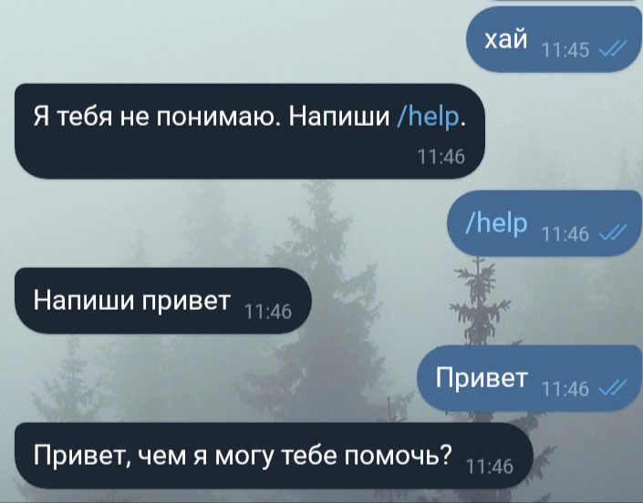
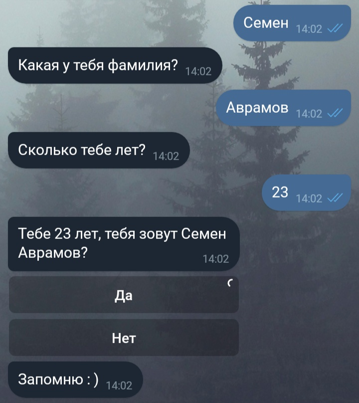

# Part 1: Registering a bot

The simplest and most described part. Very briefly: you need to find the bot [@BotFather](https://telegram.me/BotFather), write to him /start, or / newbot, fill in the fields that he asks (the name of the bot and its short name), and get a message with the bot token and a link to the documentation. The token must be saved, preferably securely, since this is the only key for authorization of the bot and interaction with it.

# Part 2: Preparing to write code

As already mentioned in the title, we will write the bot in Python. This article will describe working with the PyTelegramBotAPI (Telebot) library. If you don't have Python installed, then first you need to do this: in the Linux terminal, you need to enter

	sudo apt-get install python python-pip

If you use Windows, then you need to download Python from the official website.

After that, in the Linux terminal, or the Windows command line, enter

	pip install pytelegrambotapi

Now everything is ready to write the code.

# Part 3: We receive messages and say "Hello"

A small digression. Telegram is able to inform the bot about user actions in two ways: through a response to a server request (Long Poll), and through a Webhook, when the Telegram server itself sends a message that someone wrote to the bot. The second method clearly looks better, but requires a dedicated IP address, and SSL installed on the server. In this article, I want to talk about writing a bot, not setting up a server, so we will use a Long Poll.

Open your favorite text editor and let's write the bot code!

The first thing to do is to import our library and connect the bot token:

```python
import telebot;
bot = telebot.TeleBot ('%your token%');
```

Now let's declare a method for receiving text messages:

```python
@bot.message_handler(content_types=['text'])
def get_text_messages(message):
```

In this section of the code, we have declared a listener for text messages and a method for processing them. The content_types field can take different values, and not just one, for example

```python
@bot.message_handler(content_types=['text', 'document', 'audio'])
```
It will respond to text messages, documents and audio. You can read more in the official documentation

Now let's add some functionality to our method: if the user writes us "Hello", then we will tell him "Hello, how can I help?", and if they write us the command "/help", then we will tell the user to write "Hello":

```python
if message.text == "Hello":
bot.send_message(message.from_user.id , "Hi, how can I help you?")
elif message.text == "/help":
bot.send_message(message.from_user.id , "Write hello")
else:
bot.send_message(message.from_user.id "I don't understand you. Write /help.")
```

This section of the code does not require comments, as it seems to me. Now we need to add only one line to our code (outside of all methods).

```python
bot.polling(none_stop=True, interval=0)
```

Now our bot will constantly ask the Telegram server "Has someone written to me?", and if we write to our bot, the Telegram will give him our message. Save the entire file, and write in the console

	python bot.py

Where bot.py – the name of our file.

Now you can write to the bot and see the result:



# Part 4: Buttons and Message Branches

Sending messages is undoubtedly fun, but it's even more fun to have a dialogue with the user: ask him questions and get answers to them. Let's say now our bot will ask the user in turn for his first name, last name and age. To do this, we will use the register_next_step_handler method of the bot:

```python
name = '';
surname = '';
age = 0;
@bot.message_handler(content_types=['text'])
def start(message):
    if message.text == '/reg':
        bot.send_message(message.from_user.id , "What is your name?");
        bot.register_next_step_handler(message, get_name); #the next step is the get_name else function
    else:
        bot.send_message(message.from_user.id , 'Write /reg');

def get_name(message): #getting the last name
    global name;
    name = message.text;
    bot.send_message(message.from_user.id , 'What is your last name?');
    bot.register_next_step_handler(message, get_surnme);

def get_surname(message):
    global surname;
    surname = message.text;
    bot.send_message('How old are you?');
    bot.register_next_step_handler(message, get_age);

def get_age(message):
    global age;
    while age == 0: #check that the age has changed
        try:
            age = int(message.text) #check that the age is entered correctly
        except Exception:
            bot.send_message(message.from_user.id , 'In numbers, please');
        bot.send_message(message.from_user.id , 'You'+str(age)+' years, your name is '+name+' '+surname+'?')
```

And so, we recorded the user's data. This example shows a very simplified example, in a good way, you need to store intermediate data and user states in a database, but today we are working with a bot, not databases. The final touch – we will ask users to confirm that everything is entered correctly, and not just like that, but with buttons! To do this, edit the code of the get_age method a little

```python
def get_age(message):
    global age;
    while age == 0: #check that the age has changed
        try:
            age = int(message.text) #check that the age is entered correctly
        except Exception:
            bot.send_message(message.from_user.id , 'In numbers, please');
        keyboard = types.InlineKeyboardMarkup(); #our keyboard
        key_yes = types.InlineKeyboardButton(text='Yes', callback_data='yes'); #Yes button
        keyboard.add(key_yes); #add button to keyboard
        key_no= types.InlineKeyboardButton(text='No', callback_data='no');
        keyboard.add(key_no);
        question = 'You '+str(age)+' years, your name is '+name+' '+surname+'?';
        bot.send_message(message.from_user.id, text=question, reply_markup=keyboard)
```

And now our bot sends the keyboard, but if you click on it, nothing will happen. Because we haven't written a handler method. Let's write:

```python
@bot.callback_query_handler(func=lambda call: True)
def callback_worker(call):
     if call.data == "yes": #call.data is the callback_data we specified when declaring the button
         .... #code for saving data, or processing it
         bot.send_message(call.message.chat.id , 'I will remember :)');
     elif call.data == "no":
         ... #asking again
```

It remains only to add one line to the beginning of the file:

	from telebot import types

That's all, save and launch our bot:



<br>
--------<br>
source: https://habr.com/ru/post/442800/
