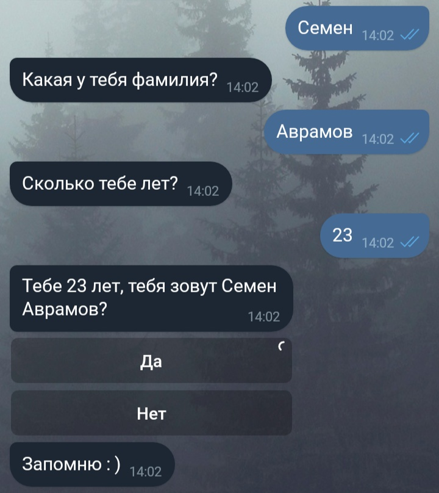

# Часть 1: Регистрация бота

Самая простая и описанная часть. Очень коротко: нужно найти бота [@BotFather](https://telegram.me/BotFather), написать ему /start, или /newbot, заполнить поля, которые он спросит (название бота и его короткое имя), и получить сообщение с токеном бота и ссылкой на документацию. Токен нужно сохранить, желательно надёжно, так как это единственный ключ для авторизации бота и взаимодействия с ним.

# Часть 2: Подготовка к написанию кода

Как уже было сказано в заголовке, писать бота мы будем на Python'е. В данной статье будет описана работа с библиотекой PyTelegramBotAPI (Telebot). Если у вас не установлен Python, то сперва нужно сделать это: в терминале Linux нужно ввести

	sudo apt-get install python python-pip

Если же вы пользуетесь Windows, то нужно скачать Python с официального сайта .

После, в терминале Linux, или командной строке Windows вводим

	pip install pytelegrambotapi

Теперь все готово для написания кода.

# Часть 3: Получаем сообщения и говорим «Привет»

Небольшое отступление. Телеграмм умеет сообщать боту о действиях пользователя двумя способами: через ответ на запрос сервера (Long Poll), и через Webhook, когда сервер Телеграмма сам присылает сообщение о том, что кто-то написал боту. Второй способ явно выглядит лучше, но требует выделенного IP-адреса, и установленного SSL на сервере. В этой статье я хочу рассказать о написании бота, а не настройке сервера, поэтому пользоваться мы будем Long Poll'ом.

Открывайте ваш любимый текстовый редактор, и давайте писать код бота!

Первое, что нужно сделать это импортировать нашу библиотеку и подключить токен бота:

```python
import telebot;
bot = telebot.TeleBot('%ваш токен%');
```

Теперь объявим метод для получения текстовых сообщений:

```python
@bot.message_handler(content_types=['text'])
def get_text_messages(message):
```

В этом участке кода мы объявили слушателя для текстовых сообщений и метод их обработки. Поле content_types может принимать разные значения, и не только одно, например

```python
@bot.message_handler(content_types=['text', 'document', 'audio'])
```

Будет реагировать на текстовые сообщения, документы и аудио. Более подробно можно почитать в официальной документации

Теперь добавим в наш метод немного функционала: если пользователь напишет нам «Привет», то скажем ему «Привет, чем я могу помочь?», а если нам напишут команду «/help», то скажем пользователю написать «Привет»:

```python
if message.text == "Привет":
    bot.send_message(message.from_user.id, "Привет, чем я могу тебе помочь?")
elif message.text == "/help":
    bot.send_message(message.from_user.id, "Напиши привет")
else:
    bot.send_message(message.from_user.id, "Я тебя не понимаю. Напиши /help.")
```

Данный участок кода не требует комментариев, как мне кажется. Теперь нужно добавить в наш код только одну строчку (вне всех методов).

```python
bot.polling(none_stop=True, interval=0)
```

Теперь наш бот будет постоянно спрашивать у сервера Телеграмма «Мне кто-нибудь написал?», и если мы напишем нашему боту, то Телеграмм передаст ему наше сообщение. Сохраняем весь файл, и пишем в консоли

	python bot.py


Где bot.py – имя нашего файла.

Теперь можно написать боту и посмотреть на результат:


# Часть 4: Кнопки и ветки сообщений

Отправлять сообщения это несомненно весело, но ещё веселее вести с пользователем диалог: задавать ему вопросы и получать на них ответы. Допустим, теперь наш бот будет спрашивать у пользователя по очереди его имя, фамилию и возраст. Для этого мы будем использовать метод register_next_step_handler бота:

```python
name = '';
surname = '';
age = 0;
@bot.message_handler(content_types=['text'])
def start(message):
    if message.text == '/reg':
        bot.send_message(message.from_user.id, "Как тебя зовут?");
        bot.register_next_step_handler(message, get_name); #следующий шаг – функция get_name
    else:
        bot.send_message(message.from_user.id, 'Напиши /reg');

def get_name(message): #получаем фамилию
    global name;
    name = message.text;
    bot.send_message(message.from_user.id, 'Какая у тебя фамилия?');
    bot.register_next_step_handler(message, get_surnme);

def get_surname(message):
    global surname;
    surname = message.text;
    bot.send_message('Сколько тебе лет?');
    bot.register_next_step_handler(message, get_age);

def get_age(message):
    global age;
    while age == 0: #проверяем что возраст изменился
        try:
             age = int(message.text) #проверяем, что возраст введен корректно
        except Exception:
             bot.send_message(message.from_user.id, 'Цифрами, пожалуйста');
      bot.send_message(message.from_user.id, 'Тебе '+str(age)+' лет, тебя зовут '+name+' '+surname+'?')
```

И так, данные пользователя мы записали. В этом примере показан очень упрощённый пример, по хорошему, хранить промежуточные данные и состояния пользователя нужно в БД, но мы сегодня работаем с ботом, а не с базами данных. Последний штрих – запросим у пользователей подтверждение того, что все введено верно, да не просто так, а с кнопками! Для этого немного отредактируем код метода get_age

```python
def get_age(message):
    global age;
    while age == 0: #проверяем что возраст изменился
        try:
             age = int(message.text) #проверяем, что возраст введен корректно
        except Exception:
             bot.send_message(message.from_user.id, 'Цифрами, пожалуйста');
      keyboard = types.InlineKeyboardMarkup(); #наша клавиатура
      key_yes = types.InlineKeyboardButton(text='Да', callback_data='yes'); #кнопка «Да»
      keyboard.add(key_yes); #добавляем кнопку в клавиатуру
      key_no= types.InlineKeyboardButton(text='Нет', callback_data='no');
      keyboard.add(key_no);
      question = 'Тебе '+str(age)+' лет, тебя зовут '+name+' '+surname+'?';
      bot.send_message(message.from_user.id, text=question, reply_markup=keyboard)
```

И теперь наш бот отправляет клавиатуру, но если на нее нажать, то ничего не произойдёт. Потому что мы не написали метод-обработчик. Давайте напишем:

```python
@bot.callback_query_handler(func=lambda call: True)
def callback_worker(call):
    if call.data == "yes": #call.data это callback_data, которую мы указали при объявлении кнопки
        .... #код сохранения данных, или их обработки
        bot.send_message(call.message.chat.id, 'Запомню : )');
    elif call.data == "no":
         ... #переспрашиваем
```

Остаётся только дописать в начало файла одну строку:

	from telebot import types


Вот и всё, сохраняем и запускаем нашего бота:



<br>
--------<br>
Источник: https://habr.com/ru/post/442800/
